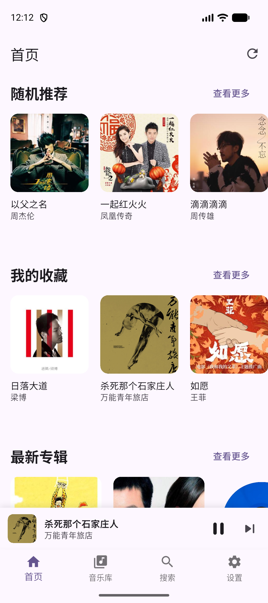
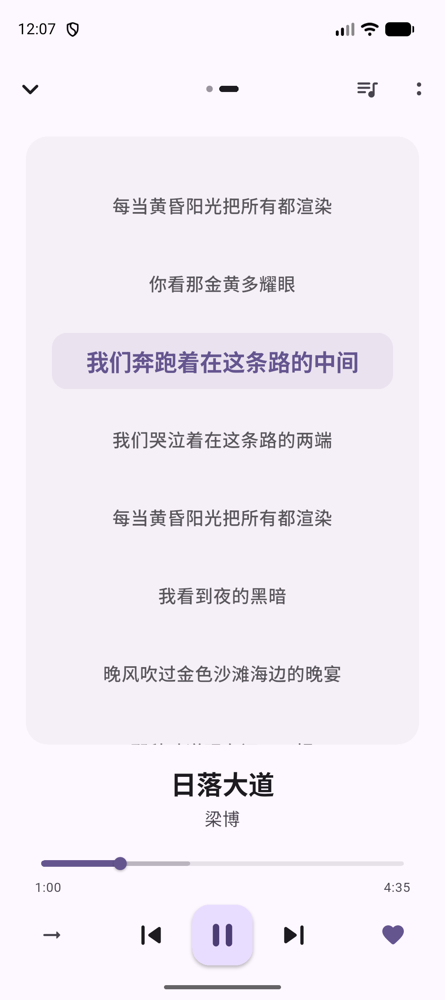
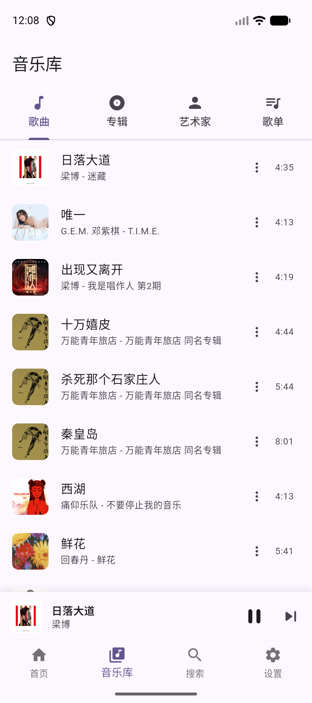
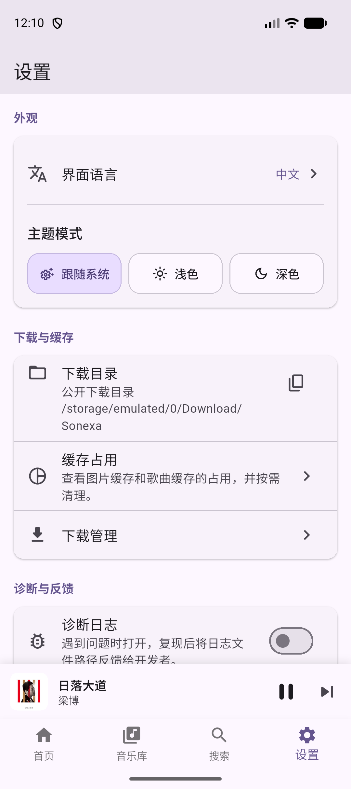

# Sonexa / 音联

Sonexa 是一个面向自托管音乐用户的开源客户端。
它目前主要围绕 **Navidrome** 和 **兼容 Subsonic 协议** 的服务器来做，希望把自托管音乐这件事做成一个更完整、更舒服的体验。

> 你的音乐，随处可听。

[English](README.en.md)

* * *

## 📱 界面预览

| 首页 | 播放页 |
| --- | --- |
|  |  |

| 音乐库 | 设置 |
| --- | --- |
|  |  |

* * *

## ✨ 功能特性

- 完整的音乐库浏览与首页推荐体验
- 持续化的播放、队列与进度恢复
- 可用的同步歌词、替换与校准能力
- 下载、缓存、离线播放与基础清理工具
- 面向排障的诊断日志与导出能力

* * *

## ⚡ 快速开始

### 1. 安装依赖

```bash
flutter pub get
```

### 2. 开发运行

```bash
flutter run
```

### 3. 常用命令

```bash
flutter analyze
flutter test
flutter build apk --release
flutter build windows
flutter build linux
```

* * *

## 🧱 项目结构

```text
lib/
├── core/         公共基础设施：音频、路由、存储、主题、诊断
├── features/     认证、首页、音乐库、歌词、播放器、下载、搜索、设置
│
assets/
├── branding/     品牌与启动资源
│
android/
ios/
linux/
windows/          各平台宿主工程
│
scripts/          辅助脚本
test/             测试
```

* * *

## 🛠 技术栈

- Flutter
- Riverpod
- Drift
- Dio
- just_audio
- audio_service

* * *

## 📌 当前状态

Sonexa 目前还是一个个人项目，但主流程已经比较完整：

- 登录
- 浏览音乐库
- 播放
- 歌词
- 下载
- 缓存管理
- 诊断

现在已经是一个可以持续打磨、持续使用的播放器项目。

* * *

## 🤖 关于这个项目的开发方式

Sonexa 是我第一款几乎完全通过 **vibe coding / AI-assisted development** 做出来的应用。

这也意味着两件事：

- 我并不是这个技术栈里的资深开发者，所以对部分实现细节、架构取舍和底层平台问题的理解还在持续补课中
- 仓库里的 bug、issue 或 PR，我会认真看，但响应速度有时可能不会特别快

另一方面，我也愿意把它当成一个对 AI 协作开发更开放的项目来看待。
如果你的想法、修复方式，甚至贡献过程本身带有明显的 AI 辅助痕迹，这在这里并不是问题。

* * *

## 🗺 后续计划

- 继续打磨 Android、Windows、Linux 之间的一致性
- 持续优化歌词体验
- 在当前基础上扩展更多服务端兼容性
- 继续完善诊断与恢复能力

* * *

## 📎 说明

- Sonexa 是客户端，不是音乐服务器
- 当服务器本地没有可用歌词时，部分歌词能力可能会回退到公开歌词源
- 仓库中包含多个 Flutter 平台目录，但不同平台的验证深度会随着开发阶段变化

* * *

## 📄 开源协议

本项目采用 **GNU GPL-3.0** 协议。

这意味着：

- 允许个人使用
- 允许修改
- 允许商用
- 但如果你分发基于本项目修改后的版本，也需要继续公开对应源码，并遵守 GPL-3.0

完整协议内容见仓库中的 [LICENSE](LICENSE)。

* * *

## ⭐ 支持一下

如果你觉得这个项目还不错，欢迎点个 Star。
